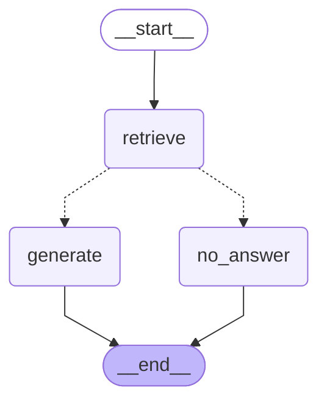

# Docs Agent
RAG agent that answers questions about FastAPI documentation, with source citations.

## What it does
Ask a question about FastAPI and get an answer built from the actual documentation, not from the model's memory. Docs Agent gives you a link to a proper place in the documentation and shows relevant information. If the retrieval finds no relevant information, it will answer "I didn't find an answer in the documentation", instead of hallucinating an answer.

## Architecture



## Indexing
The indexer splits markdown documents from FastAPI documentation, splitting on markdown headers (## through ####). Code examples are referenced in the markdown rather than inlined, so the pipeline resolves those references and inlines the actual .py files. It computes embeddings and stores them in PostgreSQL with pgvector.

## Query
1. The query is converted into an embedding using the same model as during indexing
2. Search the database using cosine similarity, return the top 5 closest chunks
3. Threshold filter - only chunks with a score above 0.4 remain
4. If any remain, chunks are sent to Claude as context. If not, the agent declines without calling the model

## Design decisions

### Custom chunker instead of an off-the-shelf splitter
LangChain's `MarkdownHeaderTextSplitter` would cover the basic case, but FastAPI's docs have three things it does not handle. Python comments inside fenced code blocks start with `#` and would be mistaken for headers, so the splitter tracks whether it is inside a code block. 
Code examples are not inlined in the markdown - they are MkDocs references to separate `.py` files, which the pipeline resolves before splitting. 
Finally, short intro sentences that sit before the first header are merged into the following chunk instead of becoming standalone fragments with no context.

### Threshold filtering instead of fixed top-k
Threshold is set to 0.4 so the system does not always return top 5 results if there is nothing relevant enough. Thanks to that the system avoids passing chunks that are unrelated to the question.
Measured on the evaluation set, correct matches score 0.50-0.65 while irrelevant ones fall to 0.30-0.34, so 0.4 sits in the gap. The number of chunks sent to the model varies per query - five for a good match, sometimes one, sometimes none.

### Refusal happens in the graph, not in the prompt
If no chunk passes the threshold, a conditional edge routes the run to a node that returns a fixed message, so the model is never called. The system prompt also tells the model to refuse, but that is only a backup: an instruction can be ignored, a routing decision cannot. It is also free, since there is no API call at all.

### pgvector instead of a dedicated vector DB
Chunks and their metadata sit in one database, so foreign keys and cascading deletes come for free. Deleting a document deletes its chunks. A separate vector store would be a second service to run and keep in sync, which is hard to justify for only 461 chunks. At a much larger scale, using a dedicated vector database would probably be a better idea.

## Evaluation

`eval/questions.json` holds 17 questions with the source file that should answer each one.
Run with `python -m eval.run_eval`.

Result: 16/17 in the top 5, 12 ranked first. The miss is a question phrased as a symptom ("browser blocking my API calls") where `cors.md` uses spec language. No chunk passed the threshold, so the agent refused.

## Setup

```bash
# 1. FastAPI docs are read from disk - clone them anywhere outside this repo
git clone --depth 1 https://github.com/fastapi/fastapi.git

# 2. Set env vars: DATABASE_URL, DOCS_AGENT_DB_PASS, DOCS_PATH, DOCS_ROOT,
#    OPENAI_API_KEY, ANTHROPIC_API_KEY

# 3. Database (schema and HNSW index are created on first run)
docker compose up -d

# 4. Index
pip install -r requirements.txt
python -m app.loader

# 5. Run
uvicorn app.main:app --reload
```

Interactive docs at `http://127.0.0.1:8000/docs`.

## Limitations

- Retrieval is vector-only, so questions phrased as symptoms rather than in the vocabulary of the docs can miss - hybrid search or query rewriting with a cheap model would help
- No conversation history: every question is answered independently, follow-ups like "and how do I test that?" have no context
- One language and one version are indexed, although the schema supports filtering by both
- Tests: the chunker has unit tests, retrieval has no integration tests - that would need a database in CI
